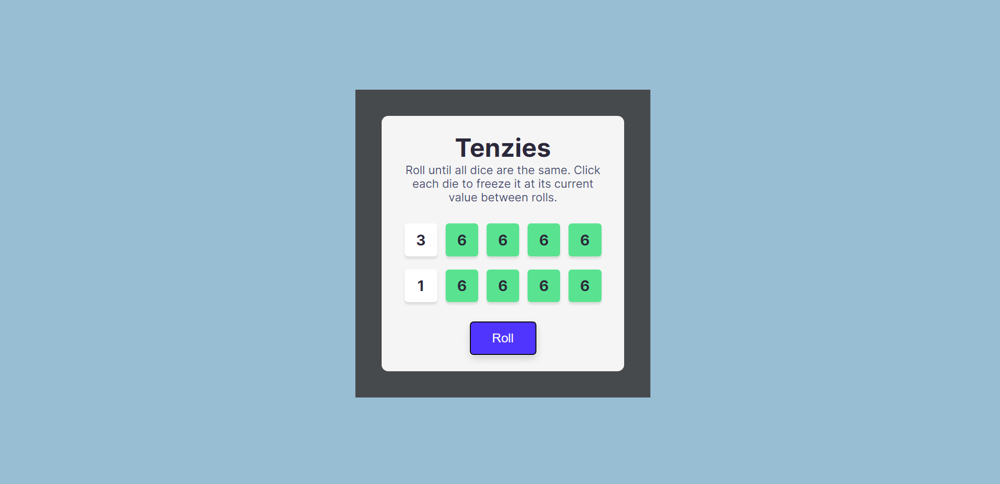

# Tenzies Game

</img>

## Try it Live!

Check out the live app [tenzies](https://tenzies-game-sigma-gold.vercel.app/)

## How to Use

Roll until add dice are the same. Click each die to freeze it at its current value between rolls.

## Tools Used

-   React
-   CSS
-   Vite

## Getting Started

1. Clone this repository.

    ```bash
    git clone https://github.com/mahmoud-mohsen-dev/tenzies-game.git
    ```

2. Navigate to the Project Directory:
    ```bash
    cd tenzies-game
    ```
3. Install Dependencies:

    ```bash
     npm install
    ```

4. Start the Development Server:

    ```bash
    npm run dev
    ```

5. Open in your Browser:

    Open your web browser and go to http://localhost:3000 to see the app in action.

Now you have the "Tenzies Game" app up and running on your local machine.

_This poject was part of Scrimba React Course_
